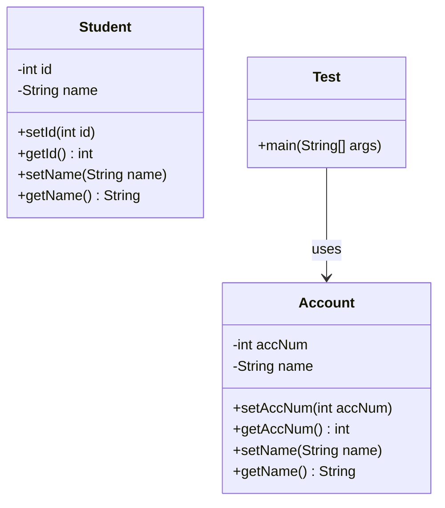

```markdown
# 🔐 Access Specifiers in Java

| Specifier   | Scope / Accessibility |
|-------------|-----------------------|
| **public**  | Accessible from anywhere (global) |
| **private** | Accessible only within the same class |
| **protected** | Accessible within the same package and in subclasses (even in different packages) |
| **default** (no modifier) | Accessible only within the same package |

> **Notes:**
> - A class cannot be declared `private` because the compiler and JVM wouldn’t be able to access it.
> - If a class **and** its constructor are `private`, objects can only be created **inside** that class.

---

# ⚙️ Object-Oriented Programming (OOP) in Java

Java is an **OOP language** because it supports the four pillars of object-oriented programming.

## 1. Encapsulation
- Combining variables and methods into a single unit (class).
- Main purpose: **Data Hiding**.
- Achieved using `private` variables + `public` getters/setters.

---

## 2. Abstraction
- Hiding unnecessary details and exposing only essential features.
- Achieved using **abstract classes** and **interfaces**.

---

## 3. Inheritance
- Extending properties and methods from one class to another.
- Promotes **code reusability**.

---

## 4. Polymorphism
- Exhibiting multiple behaviors based on the situation.
- Achieved via **method overloading** and **method overriding**.

---

# 🛠 Getter and Setter Methods

**Definition:**
- **Getter** → Returns the value of a private variable.
- **Setter** → Sets/updates the value of a private variable.

**Purpose:**
- Controlled access to private variables.
- Data security and validation before updating values.

**Syntax Example:**
```java
public class Example {
    private int id;

    // Setter
    public void setId(int id) {
        this.id = id;
    }

    // Getter
    public int getId() {
        return this.id;
    }
}
```

**Shortcut in Eclipse:**  
Press **`ALT + SHIFT + S + R`** to auto-generate getters and setters.

---

# 🧪 Encapsulation Examples

## Student Example
```java
public class Student {
    private int id;
    private String name;

    public void setId(int id) {
        this.id = id;
    }
    public int getId() {
        return this.id;
    }

    public void setName(String name) {
        this.name = name;
    }
    public String getName() {
        return this.name;
    }
}
```

---

## BankAccount Example
```java
public class BankAccount {
    private long acc = 799873;
    private String name;

    public void setAcc(long acc) {
        this.acc = acc;
    }
    public long getAcc() {
        return this.acc;
    }

    public void setName(String name) {
        this.name = name;
    }
    public String getName() {
        return this.name;
    }
}
```

---

## Account + Test Example
```java
public class Account {
    private int accNum;
    private String name;

    public void setAccNum(int accNum) {
        this.accNum = accNum;
    }
    public int getAccNum() {
        return this.accNum;
    }

    public void setName(String name) {
        this.name = name;
    }
    public String getName() {
        return this.name;
    }
}
```

```java
public class Test {
    public static void main(String[] args) {
        Account obj = new Account();
        obj.setAccNum(797979);
        obj.setName("Ashok");

        int accNum = obj.getAccNum();
        String name = obj.getName();

        System.out.println(accNum + "--" + name);
    }
}
```

---

# 📊 Mermaid Diagram: Encapsulation Flow


```
